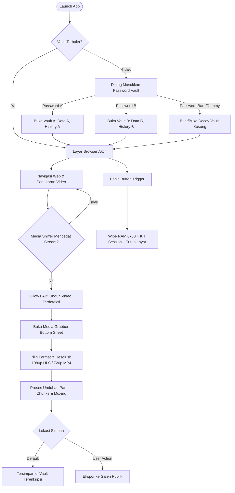

# YourBrowser Design System: UI/UX Specification & ASCII Wireframes
*Versi: 1.0.0 | Status: Production Blueprint | Platform: Android (Material3 & Compose/XML compatible)*

---

## 1. Filosofi Desain & Karakter Visual

**YourBrowser** dirancang dengan prinsip utama: **Stealth, Minimalist, High-Utility, and Zero-Friction Security**.

* **Stealth & Privacy-First**: Antarmuka tidak boleh mencolok atau menarik perhatian yang tidak diinginkan di tempat umum. Skema warna dominan *Obsidian Dark* dengan kontras fungsional tinggi. Tidak ada data pribadi atau jejak sesi yang tampil di layar tanpa otentikasi.
* **Pro-Utility (Media Engine)**: Deteksi media streaming harus bersifat tidak mengganggu (*unobtrusive*) namun langsung siap tanggap (*highly reactive*) saat media video terdeteksi (seperti pengalaman UC Browser era keemasan, namun tanpa iklan dan bloatware).
* **Plausible Deniability**: Tidak ada petunjuk visual mengenai berapa banyak vault yang tersimpan di perangkat. Desain dialog autentikasi selalu identik baik untuk vault utama, vault decoy, maupun inisialisasi vault baru.
* **Ergonomi Satu Tangan (Thumb-Zone Friendly)**: Kontrol kritis (Omnibox, Sniffer Grabber, Navigation Toolbar, Panic Trigger) dioptimalkan pada 1/3 area bawah layar perangkat seluler.

---

## 2. Token Desain (Foundational Tokens)

### 2.1 Color Palette & Semantic Color Mapping

| Token Name | Hex Value | Semantic Purpose / Usage |
| :--- | :--- | :--- |
| `color-bg-base` | `#0B0F19` | Latar belakang kanvas aplikasi paling dasar (Deep Obsidian). |
| `color-surface-1` | `#111827` | Surface kartu, dialog, dan header bar (`elevation-1`). |
| `color-surface-2` | `#1F2937` | Surface input field, bottom sheet, dan search box (`elevation-2`). |
| `color-surface-border`| `#374151` | Garis pembatas komponen non-aktif. |
| `color-text-primary` | `#F9FAFB` | Teks utama, judul, URL host aktif (kontras 14.5:1). |
| `color-text-secondary`| `#9CA3AF` | Teks subjudul, mime-type, timestamp, URL path. |
| `color-text-tertiary` | `#6B7280` | Placeholder, label non-aktif, breadcrumb path. |
| `color-accent-cyan` | `#06B6D4` | Aksen sniffer media, tombol aksi download, badge download aktif. |
| `color-accent-hover`| `#0891B2` | State pressed/focus tombol aksen. |
| `color-vault-secure`| `#10B981` | Indikator vault terenkripsi aktif, status muxing selesai. |
| `color-vault-warn` | `#F59E0B` | Peringatan stream protected (DRM/Blob MSE fragmented). |
| `color-panic-red` | `#EF4444` | Tombol Panic/Kill-switch, kegagalan download, session wipe. |
| `color-shield-track`| `#8B5CF6` | Tracker & Ad-blocker protection active badge. |

### 2.2 Skala Tipografi (Typography Scale)

Menggunakan font sistem sans-serif modern (`Inter` / `Roboto` / `system-ui`) untuk UI, dan monospace (`JetBrains Mono` / `Roboto Mono`) untuk URL, ukuran file, chunk rate, dan Vault ID.

| Role | Font Family | Size (sp) | Line Height | Weight | Usage |
| :--- | :--- | :--- | :--- | :--- | :--- |
| **Headline-L** | Sans-Serif | 20sp | 28sp | Bold (700) | Judul bottom sheet, dialog utama |
| **Headline-M** | Sans-Serif | 16sp | 24sp | Semi-Bold (600) | Judul stream video, header tab |
| **Body-L** | Sans-Serif | 15sp | 22sp | Regular (400) | Isi teks petunjuk, deskripsi |
| **Body-M** | Sans-Serif | 13sp | 18sp | Regular (400) | URL path, metadata media |
| **Code-URL** | Monospace | 13sp | 18sp | Medium (500) | Omnibox URL input & hostname |
| **Label-Bold** | Sans-Serif | 12sp | 16sp | Semi-Bold (600) | Tombol aksi (DOWNLOAD, EXPORT) |
| **Badge-Mono** | Monospace | 11sp | 14sp | Bold (700) | Vault Hash ID, Resolusi (1080p, HLS) |

### 2.3 Spacing, Grid & Hit Targets

* **Base Unit**: `4dp` (semua margin/padding menggunakan kelipatan 4dp: 4, 8, 12, 16, 20, 24, 32dp).
* **Minimum Touch Target**: `48dp x 48dp` untuk seluruh elemen interaktif (memenuhi standar WCAG AAA & Android Human Interface Guidelines).
* **Corner Radius Hierarchy**:
  * `radius-xs`: `4dp` (Badge kecil, tag format).
  * `radius-sm`: `8dp` (Input field, button standard).
  * `radius-md`: `12dp` (Card item stream, tab thumbnail).
  * `radius-lg`: `16dp` (Dialog pop-up, modal container).
  * `radius-full`: `9999dp` (Floating Action Badge, Vault Indicator Pill).

---

## 3. Komponen Inti UI (Core Components)

### 3.1 Stealth Omnibox & URL Bar
* Terletak di bagian atas/bawah sesuai preferensi, dilengkapi proteksi HTTPS lock dan penghitung pemblokir pelacak (Tracker Shield).
* Mengaburkan domain sekunder, menonjolkan domain utama (*e.g.,* **youtube.com**/watch?v=...).

### 3.2 Vault Indicator & Panic Pill
* Menampilkan status isolasi sesi aktif (`🔒 Vault: [Hash 8-char]`).
* Menekan indikator membuka *Vault Switcher*.
* *Long-press* atau geser cepat mengaktifkan **Panic Kill-Switch** (pembersihan memori seketika dan penguncian total).

### 3.3 Floating Sniffer Badge (Reactive Media Grabber)
* Tombol aksi melayang adaptif (`ExtendedFloatingActionButton`).
* Default: Tersembunyi saat tidak ada media streaming.
* Trigger: Muncul otomatis dengan animasi *pulse/glow* biru sian saat hook jaringan/DOM mendeteksi URL video (`.mp4`, `.m3u8`, `.mpd`, Blob MSE).
* Menampilkan counter media: `⚡ Unduh Video (N)`.

### 3.4 Media Grabber Bottom Sheet
* Menampilkan daftar semua video/audio yang tertangkap di halaman.
* Label resolusi (1080p, 720p, 480p, Audio Only), format (HLS, DASH, Direct), estimasi ukuran segmen, dan tombol unduh langsung.
* Multi-segment download progress bar dengan kecepatan transfer real-time (KB/s atau MB/s).

### 3.5 Plausible Deniability Vault Prompt
* Tampilan input kata sandi minimalis tanpa indikasi vault mana yang tersimpan.
* Tidak ada tombol "Lupa Kata Sandi" atau daftar akun demi integritas anti-forensik.

---

## 4. Alur Pengalaman Pengguna (UX Flows)



---

## 5. Komprehensif ASCII Wireframes

### Wireframe 1: Layar Utama Peramban (Main Browser with Sniffer Triggered)

```text
+-------------------------------------------------------------+
| [4G 85%]                                          15:30 WIB |
+-------------------------------------------------------------+
| [🔒 Vault: 9a4f8e12]  [🛡️ 14]  [ https://videohub.net/watch ]|
+-------------------------------------------------------------+
| [Progress Loading Bar: ================================== ] |
|                                                             |
|   +-----------------------------------------------------+   |
|   |                  VIDEO PLAYER WEB                   |   |
|   |                                                     |   |
|   |                      ▶ PLAY                         |   |
|   |                                                     |   |
|   | 01:24 ------------------------O-------------- 10:45 |   |
|   +-----------------------------------------------------+   |
|                                                             |
|   Video Title: Cyber Security Masterclass 2026              |
|   Channel: TechLabs | 450K views                            |
|                                                             |
|   Description:                                              |
|   Panduan implementasi zero-knowledge architecture...       |
|                                                             |
|   [ Like ]  [ Share ]  [ Save ]                             |
|                                                             |
|   Related Videos:                                           |
|   +-----------------------------------------------------+   |
|   | [Thumb] Building Custom Android GeckoView Engine    |   |
|   +-----------------------------------------------------+   |
|   | [Thumb] HLS Segment Muxing without Re-encoding      |   |
|   +-----------------------------------------------------+   |
|                                                             |
|                                     +-------------------+   |
|                                     | ⚡ Unduh Video (3) |   |
|                                     +-------------------+   |
+-------------------------------------------------------------+
|  [ < ]     [ > ]     [ 🏠 ]     [ ⊞ 3 ]     [ ⬇ ]     [ 🚨 ]  |
+-------------------------------------------------------------+
 * Keterangan Toolbar Bawah:
   [ < ] Back | [ > ] Fwd | [ 🏠 ] Home | [ ⊞ 3 ] Tabs | [ ⬇ ] Queue | [ 🚨 ] PANIC
```

---

### Wireframe 2: Dialog Autentikasi Vault (Zero-Knowledge & Plausible Deniability)

```text
+-------------------------------------------------------------+
|                                                             |
|         +-----------------------------------------+         |
|         | 🔒 BUKA SESI VAULT                      |         |
|         |-----------------------------------------|         |
|         | Masukkan kata sandi vault Anda.         |         |
|         | Setiap kata sandi yang berbeda akan     |         |
|         | membuka partisi sesi terenkripsi yang   |         |
|         | terisolasi secara zero-knowledge.       |         |
|         |                                         |         |
|         | [••••••••••••••••••••••••] [👁️]         |         |
|         |                                         |         |
|         | [✓] Hapus cache saat aplikasi ditutup   |         |
|         |                                         |         |
|         | +-------------------------------------+ |         |
|         | |        [ BUKA / BUAT VAULT ]        | |         |
|         | +-------------------------------------+ |         |
|         |                                         |         |
|         | * Sistem tidak menyimpan daftar vault.  |         |
|         |   Plausible Deniability Aktif.          |         |
|         +-----------------------------------------+         |
|                                                             |
+-------------------------------------------------------------+
```

---

### Wireframe 3: Media Grabber Bottom Sheet (Detected Streams & Formats)

```text
+-------------------------------------------------------------+
|                                                             |
| [ Web Content Background (Dimmed 60%)                     ] |
|                                                             |
| +=========================================================+ |
| |                        ---                              | |
| | 📥 Video & Audio Terdeteksi (3)                   [ X ] | |
| |---------------------------------------------------------| |
| | Title: Cyber Security Masterclass 2026                  | |
| | URL: https://cdn.videohub.net/stream/master.m3u8        | |
| +---------------------------------------------------------+ |
| | [1080p]  HLS Master Playlist | ~145 MB                  | |
| |          Video H.264 + AAC 320kbps                      | |
| |          +--------------------------------------------+ | |
| |          |                [ UNDUH ]                   | | |
| |          +--------------------------------------------+ | |
| +---------------------------------------------------------+ |
| | [720p]   HLS Stream | ~78 MB                            | |
| |          Video H.264 + AAC 192kbps                      | |
| |          +--------------------------------------------+ | |
| |          |                [ UNDUH ]                   | | |
| |          +--------------------------------------------+ | |
| +---------------------------------------------------------+ |
| | [MP3]    Audio Only Stream | ~12 MB                     | |
| |          Direct AAC/M4A 128kbps                         | |
| |          +--------------------------------------------+ | |
| |          |                [ UNDUH ]                   | | |
| |          +--------------------------------------------+ | |
| +=========================================================+ |
+-------------------------------------------------------------+
```

---

### Wireframe 4: Status Unduhan Aktif & Konversi Muxing (In-Sheet / In-Queue)

```text
+-------------------------------------------------------------+
| +=========================================================+ |
| | ⚡ PROSES PENGUNDUHAN AKTIF                       [ _ ] | |
| |---------------------------------------------------------| |
| | File: Cyber_Security_Masterclass_1080p.mp4              | |
| | Format: HLS (.m3u8) -> Parallel 8 Chunks -> MP4         | |
| |                                                         | |
| | Progress: [=====================>--------] 68%          | |
| | Segmen: 245/360 chunks | Kecepatan: 3.4 MB/s            | |
| | Sisa Waktu: ~28 detik | Status: Mengunduh segmen...     | |
| |                                                         | |
| | [ II Jeda ]                      [ ✕ Batalkan ]         | |
| |---------------------------------------------------------| |
| | Status Pasca Selesai:                                   | |
| | [✔] Muxing audio/video via Native C++ Remuxer (Instan)  | |
| | [✔] Tersimpan aman di internal vault terenkripsi        | |
| |                                                         | |
| | +-----------------------------------------------------+ | |
| | |           [ 📥 EKSPOR KE GALERI PUBLIK ]            | | |
| | +-----------------------------------------------------+ | |
| +=========================================================+ |
+-------------------------------------------------------------+
```

---

### Wireframe 5: Pengelola Multi-Tab (Tab Switcher with Vault Context)

```text
+-------------------------------------------------------------+
| [4G 85%]                                          15:35 WIB |
+-------------------------------------------------------------+
| [ 🔒 Vault: 9a4f8e12 ]                   [ + Tab Baru ] [ ⋮ ]|
| Tab Aktif: 3 (Isolasi Sesi Vault Aktif)                     |
+-------------------------------------------------------------+
|                                                             |
|  +---------------------------+ +--------------------------+ |
|  | VideoHub - Masterclass    | | DuckDuckGo Search        | |
|  | [x]                       | | [x]                      | |
|  | +-----------------------+ | | +----------------------+ | |
|  | |                       | | | |                      | | |
|  | | [ Video Player Mini ] | | | |   Privacy Search     | | |
|  | |                       | | | |                      | | |
|  | +-----------------------+ | | +----------------------+ | |
|  | videohub.net/watch        | | duckduckgo.com           | |
|  +---------------------------+ +--------------------------+ |
|                                                             |
|  +---------------------------+                              |
|  | GitHub Repo Docs          |                              |
|  | [x]                       |                              |
|  | +-----------------------+ |                              |
|  | |                       | |                              |
|  | |   Architecture Guide  | |                              |
|  | |                       | |                              |
|  | +-----------------------+ |                              |
|  | github.com/...            |                              |
|  +---------------------------+                              |
|                                                             |
+-------------------------------------------------------------+
| [ 🔒 Kunci Sesi Vault ]              [ Tutup Semua Tab (✕) ]|
+-------------------------------------------------------------+
```

---

### Wireframe 6: Download Manager & Vault Media Library

```text
+-------------------------------------------------------------+
| [ ← Kembali ]           📁 Vault Media & Unduhan       [ 🔍 ]|
+-------------------------------------------------------------+
| [ Semua (5) ]   [ Sedang Diunduh (1) ]   [ Selesai (4) ]     |
| Penyimpanan Vault Terpakai: 480 MB (Terenkripsi AES-256)    |
+-------------------------------------------------------------+
|                                                             |
| [ Sedang Berjalan ]                                         |
| +---------------------------------------------------------+ |
| | [▶] Cyber_Security_1080p.mp4 (HLS)                      | |
| |     [===============>---------] 68% • 3.4 MB/s          | |
| |     [ II ]  [ ✕ ]                                       | |
| +---------------------------------------------------------+ |
|                                                             |
| [ Riwayat Unduhan Selesai ]                                 |
| +---------------------------------------------------------+ |
| | [🎬] Linux_Kernel_Deep_Dive.mp4                         | |
| |     142 MB • MP4 Direct • 1080p • Kemarin               | |
| |     [ ▶ Putar ]  [ 📥 Ekspor Galeri ]  [ 🗑️ Hapus ]     | |
| +---------------------------------------------------------+ |
| | [🎬] Vue3_Composition_API_Tutorial.mp4                  | |
| |     98 MB • HLS Remuxed • 720p • 2 hari lalu            | |
| |     [ ▶ Putar ]  [ 📥 Ekspor Galeri ]  [ 🗑️ Hapus ]     | |
| +---------------------------------------------------------+ |
| | [🎵] Podcast_Episode_42_Audio.mp3                       | |
| |     28 MB • Audio Stream • 320kbps • 5 hari lalu        | |
| |     [ ▶ Putar ]  [ 📥 Ekspor Galeri ]  [ 🗑️ Hapus ]     | |
| +---------------------------------------------------------+ |
|                                                             |
+-------------------------------------------------------------+
| [ 🚨 WIPE SEMUA UNDUHAN VAULT INI ]                         |
+-------------------------------------------------------------+
```

---

## 6. Accessibility (A11y), Motion & Ergonomi Produksi

1. **Color Contrast**: Seluruh teks memenuhi rasio kontras minimal 7:1 terhadap background obsidian (`#0B0F19`).
2. **Screen Reader (TalkBack)**:
   * Seluruh tombol `ImageButton` dan `ExtendedFloatingActionButton` memiliki atribut `contentDescription` spesifik dan dinamis (*e.g.,* `"Tombol unduh media, 3 video terdeteksi"`).
   * Dialog autentikasi vault mengumumkan tipe input password secara aman tanpa membacakan karakter.
3. **Motion Curves & Micro-Interactions**:
   * **Sniffer Badge Entry**: Spring scale-in animation (`OvershootInterpolator`, durasi `250ms`).
   * **Download Progress**: Smooth linear interpolation tanpa lag pada UI thread (state dipancarkan via Kotlin Coroutine StateFlow pada interval teredam `100ms`).
   * **Panic Mode**: Zero-transition instan (*fade-to-black* < `50ms`) untuk mencegah tertangkap mata orang sekitar (*visual eavesdropping*).
4. **Haptic Feedback**:
   * Vibrasi pendek (*light tick*) saat video terdeteksi oleh sniffer.
   * Vibrasi ganda (*double thud*) saat download selesai atau muxing komplit.
   * Vibrasi kuat (*heavy warning buzz*) saat tombol Panic ditekan.

---

Dokumen ini menjadi standar implementasi tampilan dan antarmuka untuk seluruh modul UI `app`, `feature/downloader`, dan `feature/vault` di YourBrowser.
