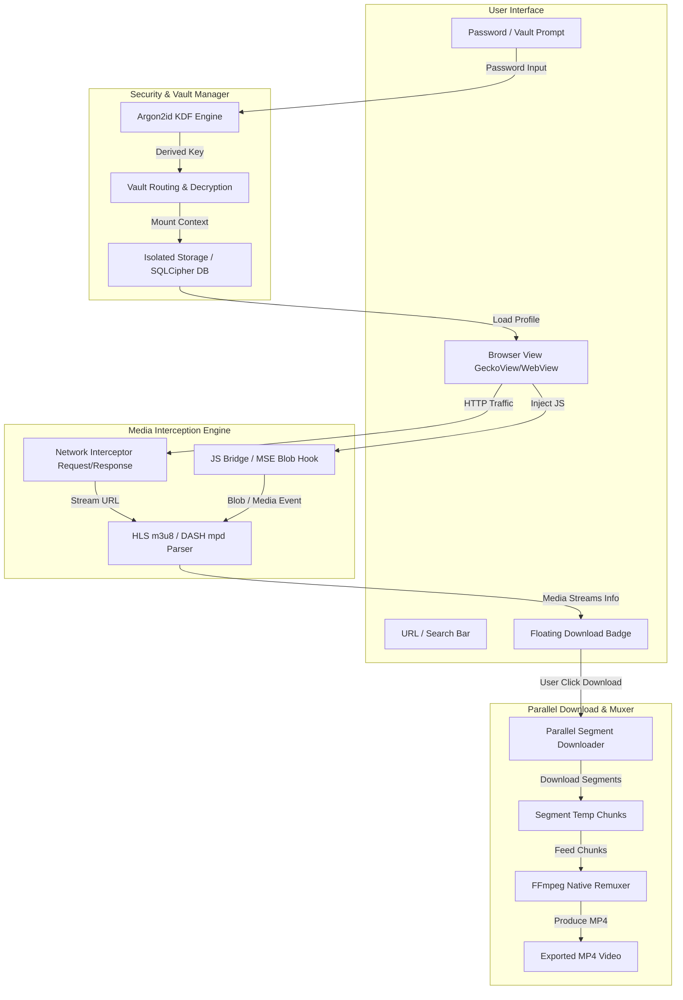

# Product Requirements Document (PRD)

## Project: YourBrowser (Android Media Sniffer & Multi-Vault Incognito Browser)
* **Status**: Draft / Proposed
* **Author**: Senior Software Engineering Team
* **Target OS**: Android 8.0+ (API 26 - 35)
* **Target Audience / Scope**: Private personal utility browser (Bebas dari restriksi Google Play Store).

---

## 1. Executive Summary & Problem Statement

Peramban seluler komersial (seperti Chrome, Edge, Firefox) membatasi pengguna dalam mengunduh konten media streaming secara bebas karena kepatuhan hak cipta dan aturan toko aplikasi. Di sisi lain, peramban seperti UC Browser terkenal dengan fitur video detector-nya, namun minim privasi dan sarat iklan/bloatware. Selain itu, mode incognito pada peramban umum bersifat global dan tidak mendukung *multi-identity privacy* (misalnya memisahkan profil kerja, profil rahasia, atau sesi sementara dengan password berbeda).

**YourBrowser** dibangun untuk memecahkan dua masalah ini:
1. **Universal Video Sniffing & Downloading**: Mendeteksi segala bentuk streaming video (Direct MP4/WebM, HLS `.m3u8`, MPEG-DASH `.mpd`, dan dynamic Blob MSE) dan memungkinkan pengunduhan lokal dengan muxing otomatis.
2. **Multi-Vault Incognito with Zero-Knowledge**: Memungkinkan pengguna memasukkan password berbeda saat membuka sesi privat, di mana setiap password memicu pembukaan *vault* terenkripsi yang sepenuhnya terpisah tanpa adanya master account yang bisa dilacak.

---

## 2. User Stories

| ID | As a... | I want to... | So that... |
| :--- | :--- | :--- | :--- |
| **US-01** | User | Membuka situs web video dan melihat indikator tombol unduh saat video diputar | Saya dapat mengunduh video tersebut ke penyimpanan lokal tanpa tools eksternal. |
| **US-02** | User | Mengunduh video streaming HLS/m3u8 dengan cepat dan stabil | Saya mendapatkan satu file `.mp4` utuh yang dapat diputar secara offline. |
| **US-03** | User | Memasukkan password "A" atau password "B" di layar autentikasi incognito | Setiap password membuka riwayat, bookmark, cookie, dan sesi penjelajahan yang berbeda. |
| **US-04** | User | Menggunakan password samaran (*decoy password*) jika dipaksa membuka browser | Orang lain hanya melihat sesi dummy/kosong tanpa mengetahui adanya vault lain (*plausible deniability*). |
| **US-05** | User | Menutup sesi privat dengan sekali sentuh | Seluruh cache RAM, key enkripsi di memori, dan temporary file langsung dihapus secara aman. |

---

## 3. Functional Requirements (FR)

### FR-1: Core Web Browsing
* **FR-1.1**: Navigasi standar (Back, Forward, Refresh, Stop, URL omnibox).
* **FR-1.2**: Multi-tab management dengan render engine responsif.
* **FR-1.3**: Bookmark dan History manager lokal yang terenkripsi per vault.
* **FR-1.4**: Ad-blocker & Tracker blocker terintegrasi (berbasis rule list Easylist / Brave engine).

### FR-2: Media Sniffer & Detection Engine
* **FR-2.1 (Network Sniffing)**: Mencegat dan mengevaluasi seluruh HTTP/HTTPS request dan response header. Mendeteksi MIME types:
  * `video/mp4`, `video/webm`, `video/x-matroska`
  * `application/x-mpegURL`, `application/vnd.apple.mpegurl` (HLS)
  * `application/dash+xml` (MPEG-DASH)
* **FR-2.2 (DOM Injection Bridge)**: Menyuntikkan JavaScript hook pada `HTMLMediaElement` (`<video>`, `<audio>`) dan `window.MediaSource` untuk menangkap `src` yang dibuat secara dinamis via Blob URLs.
* **FR-2.3 (Resolution & Stream Selector)**: Menganalisis manifest HLS/DASH untuk mengekstrak daftar kualitas video (misal 1080p, 720p, 480p, audio-only) dan menyajikannya dalam pop-up unduhan.
* **FR-2.4 (Floating Media Grabber UI)**: Menampilkan tombol download melayang (*floating action badge*) dengan jumlah media terdeteksi di halaman aktif.

### FR-3: Multi-Segment Downloader & Muxing Pipeline
* **FR-3.1 (Direct File Downloader)**: Mendukung multi-threaded chunk downloading (Range request: `bytes=start-end`) untuk mempercepat unduhan file direct `.mp4`.
* **FR-3.2 (HLS/DASH Segment Downloader)**:
  * Mengunduh segmen `.ts` / `.m4s` secara paralel (konfigurasi 4-8 concurrent workers).
  * Auto-retry dengan exponential backoff untuk segmen yang gagal.
* **FR-3.3 (Local Muxing Engine)**: Menggabungkan (*remuxing*) seluruh segmen video dan audio menjadi single container `.mp4` menggunakan FFmpeg (C/C++ JNI) tanpa re-encoding (copy stream) agar proses instan dan hemat baterai.
* **FR-3.4 (Download Manager UI)**: Tampilan antrean unduhan dengan status *Progress*, *Speed*, *Pause*, *Resume*, dan *Cancel*.

### FR-4: Multi-Vault Incognito & Zero-Knowledge Architecture
* **FR-4.1 (Password Entry & Vault Routing)**:
  * Tidak ada username atau daftar vault di UI. Hanya input field kata sandi.
  * Masukan password dilewatkan ke Argon2id KDF dengan salt internal unik untuk menghasilkan hash identifikasi vault (`VaultID`) dan Master Encryption Key (`MEK`).
* **FR-4.2 (Storage Isolation)**:
  * Setiap vault memiliki direktori data dan database sendiri di `/data/user/0/<package>/vaults/<VaultID>/`.
  * Direktori data browser (cookies, cache, WebStorage, IndexedDB) sepenuhnya terpisah per vault.
* **FR-4.3 (Plausible Deniability)**: Jika dimasukkan password baru yang belum pernah terdaftar, sistem dapat langsung menginisialisasi vault baru yang bersih tanpa ada indikasi berapa banyak vault yang ada di dalam perangkat.
* **FR-4.4 (Database Encryption)**: Menggunakan SQLCipher dengan kunci derivasi AES-256 untuk seluruh metadata per-vault.

### FR-5: Session Teardown & Anti-Forensic Protection
* **FR-5.1**: Mengaktifkan window flag `FLAG_SECURE` untuk memblokir screenshot dan menyamarkan tampilan thumbnail di Android Recent Apps.
* **FR-5.2**: Pembersihan memori (*Zeroization*): Kunci enkripsi dan buffer data sensitif di RAM di-overwrite dengan nilai nol (`0x00`) segera setelah sesi berakhir atau aplikasi masuk background.
* **FR-5.3**: Panic Button: Tindakan darurat satu tombol untuk langsung mengunci, menutup sesi aktif, dan membersihkan memori.

---

## 4. Non-Functional Requirements (NFR)

* **NFR-1 (Security & Cryptography)**:
  * Password hashing & KDF: Argon2id (`t=3, m=64MB, p=4`).
  * Enkripsi disk: AES-256-GCM authenticated encryption.
  * Tidak ada telemetry, analytics eksternal, atau koneksi ke cloud pihak ketiga.
* **NFR-2 (Performance & Efficiency)**:
  * Muxing overhead: Remuxing HLS tanpa re-encoding harus selesai dalam <10 detik untuk video durasi 10 menit pada CPU mid-range.
  * Memory footprint: Browser engine dibatasi agar tidak melampaui alokasi heap Android (maksimal 250MB per aktif tab).
* **NFR-3 (Reliability)**:
  * Download resumability: Jika koneksi internet terputus di tengah proses download HLS, download dapat dilanjutkan dari segmen terakhir yang berhasil tanpa mengulang dari awal.
* **NFR-4 (Maintainability & Clean Architecture)**:
  * Modular multi-project architecture (Clean Architecture: Domain, Data, Presentation layers).
  * Dependency Injection menggunakan Hilt / Koin.

---

## 5. System Architecture & Flow

---

## 6. Milestones & Implementation Roadmap

1. **Sprint 1: Core Foundation & Vault Architecture**
   * Multi-module Android project setup (Gradle Version Catalog, Kotlin 2.x).
   * Implementasi modul `core-crypto`: Argon2id KDF, AES-256-GCM, SQLCipher integration.
   * Implementasi isolasi data vault (data directory switching & lifecycle).
2. **Sprint 2: Browser Engine Integration**
   * Integrasi engine peramban dengan partisi konteks per vault.
   * UI navigasi dasar, omnibox, tab management, dan bookmark terenkripsi.
3. **Sprint 3: Video Sniffing Engine**
   * Network request interceptor (HTTP Header & MIME type sniffer).
   * Injected JavaScript DOM hook untuk elemen `<video>` dan `MediaSource`.
   * Manifest parser untuk HLS (`.m3u8`) dan DASH (`.mpd`).
   * Floating media download badge.
4. **Sprint 4: Multi-Threaded Downloader & FFmpeg Muxing**
   * Parallel chunk downloader dengan OkHttp & resumable state.
   * Integrasi native FFmpeg / MediaMuxer untuk stream copy ke single `.mp4`.
   * Background foreground service untuk download tidak terputus saat aplikasi di-minimize.
5. **Sprint 5: Hardening & Performance Polish**
   * Zeroization test (verifikasi penghapusan kunci dari memory dump).
   * Stresstest HLS chunk downloader dan optimasi I/O disk.
